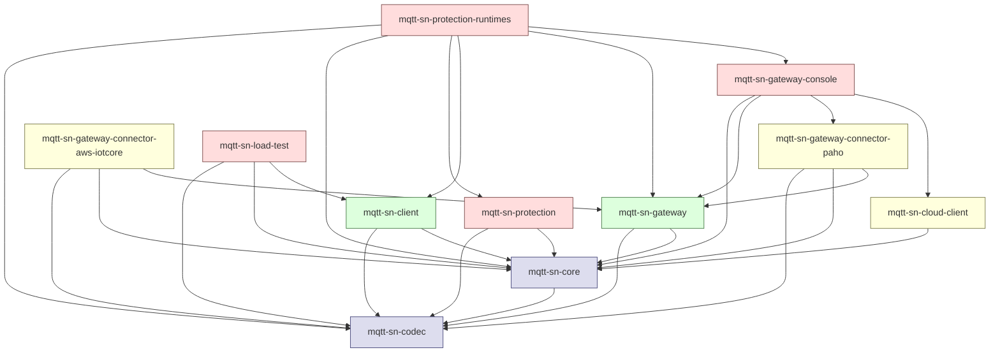

# Module Structure

The project is a multi-module Maven build (parent `org.slj:mqtt-sn:0.2.2`) packaged as `pom`. It splits the MQTT-SN implementation into a wire codec, a shared core/SPI, two runtimes (client and gateway), pluggable broker connectors, optional security and tooling, and a console UI.

## Modules

### `mqtt-sn-codec`
Dependency-free wire codec. Encodes/decodes MQTT-SN PDUs and abstracts over protocol versions (v1.2 and v2.0) via `IMqttsnCodec` and a `MqttsnMessageFactory`. The foundational module — everything else builds on it.

### `mqtt-sn-core`
Shared SPI, model, and infrastructure used by both client and gateway runtimes. Holds packages like `spi`, `model`, `impl`, `net`, `cli`, `cloud`, `tools`, `utils` — i.e. the pluggable lifecycle, transport (UDP by default), persistence, and registry abstractions.

### `mqtt-sn-client`
Reference MQTT-SN client runtime. Implements the client state machine on top of `core` + `codec`, with UDP transport out of the box and pluggable persistence/transport.

### `mqtt-sn-gateway`
Reference MQTT-SN gateway runtime (aggregating model). Terminates MQTT-SN sessions, manages topic-ID registries, sleeping clients, and will handling, and exposes a connector SPI for the upstream MQTT broker link.

### `mqtt-sn-gateway-connector-paho`
Gateway-to-broker connector backed by Eclipse Paho (MQTT v3.1.1 over TCP). The default backend bridging the gateway into any standard MQTT broker.

### `mqtt-sn-gateway-connector-aws-iotcore`
Alternative gateway connector that bridges into AWS IoT Core using the AWS IoT Device SDK (TLS + SigV4/x.509 auth instead of plain MQTT).

### `mqtt-sn-cloud-client`
Lightweight HTTP/JSON client (Jackson-based) for talking to a "MQTT-SN cloud" backend — used by the gateway console for telemetry / registration / remote management features.

### `mqtt-sn-protection`
Implementation of the MQTT-SN Protection extension (message authentication / integrity / encryption). Pulls in BouncyCastle for the crypto primitives; defines the protection packets and key handling on top of `core` + `codec`.

### `mqtt-sn-protection-runtimes`
Glue module that wires the `protection` extension into the concrete `client`, `gateway`, and `gateway-console` runtimes. Effectively a "protection-enabled distribution" assembly.

### `mqtt-sn-gateway-console`
Web/console UI and runnable distribution of the gateway. Bundles the gateway + Paho connector + cloud client into an operator-facing application (charts, config, monitoring).

### `mqtt-sn-load-test`
Standalone load generator that drives many simulated clients against a gateway. Depends on the `client` runtime to spin up sessions at scale.

## Dependency Graph

## Layering Summary

- **Foundation** — `mqtt-sn-codec` → `mqtt-sn-core`. Everything depends on these.
- **Runtimes** — `mqtt-sn-client` and `mqtt-sn-gateway` sit on the foundation and implement the two roles in the MQTT-SN topology.
- **Connectors** — `mqtt-sn-gateway-connector-paho` and `…-aws-iotcore` plug into the gateway's backend SPI and translate MQTT-SN sessions onto a real MQTT broker (Paho/TCP or AWS IoT Core).
- **Extensions / Apps** — `mqtt-sn-protection` adds the security extension; `mqtt-sn-protection-runtimes` is the integration assembly; `mqtt-sn-gateway-console` is the operator UI / shipped distribution; `mqtt-sn-cloud-client` is the HTTP client for the cloud service consumed by the console; `mqtt-sn-load-test` is a benchmarking harness.
